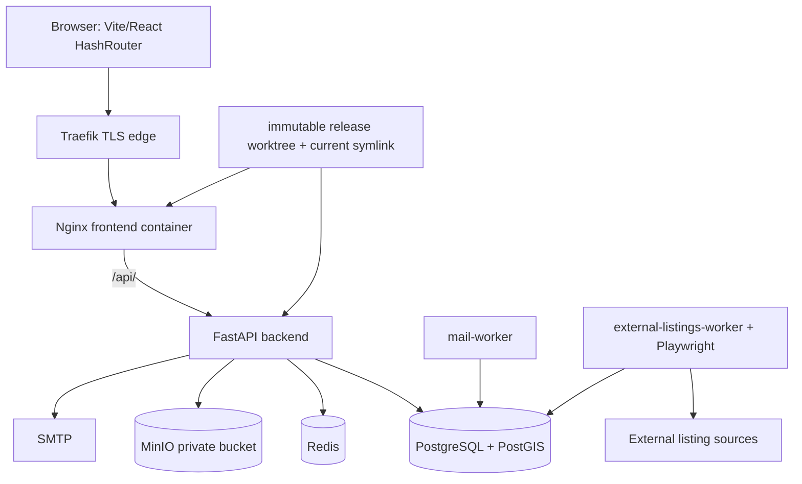

# Full System Audit — 2026-08-21

## Executive Summary

**Remediation status (2026-08-21): local validation complete; PR, CI, merge, and production deployment remain pending.**

The original conclusion for AUD-001 is **INVALID / FALSE POSITIVE**. The audit queried `https://112233.es`, which is a separate WordPress property outside this application's scope. The configured and live application origin is `https://app.112233.es` (`deploy/production.env.example:5`); independent GET checks on 2026-08-21 returned the React application shell, `200` JSON from `/api/health/live`, `/api/health/ready`, and `/api/v1/listings/catalog-version`, and `401 Authentication required` from anonymous `/api/v1/admin/access`. The WordPress apex was not modified.

AUD-002, AUD-003, and AUD-007 have source remediations and regression tests in branch `codex/remediate-audit-p1`. The remediations are not represented as production-resolved until the branch is merged and deployed.

Audit target: `antony502189-max/Ttest`, intended release `59f0025614d33d1fafd5831dc502042843cefbc7` (PR #124).  The original workspace was dirty only in pre-existing screenshot artifacts and was not changed.  The release was audited from an isolated detached worktree at that exact SHA.

The prior observation that the public production origin was unavailable was caused by checking the wrong host. `https://112233.es/` remains a separate WordPress site. The application deployment contract and current public smoke target are `https://app.112233.es`.

| Severity | Count |
|---|---:|
| P0 | 0 |
| P1 | 0 locally remediated / pending release |
| P2 | 1 |
| P3 | 3 |
| INFO | 5 |

Production-host SSH access using the supplied `root@31.97.185.84` endpoint was denied (`Permission denied (publickey,password)`), so host state, live database revision, containers, backups, restore drills, logs, resource usage, and GitHub protection could not be independently verified. Those are explicitly marked **NOT TESTED/UNKNOWN**, never assumed healthy.

## Audit Baseline

| Item | Value |
|---|---|
| Original workspace branch / SHA | `codex/admin-access-top-promotion` / `b5fb81435f273334d215791128792fe051f2a998` |
| Local `main` before fetch | `6c51324f514ace44c2644ac35970937a6ddcba92` |
| Remote `origin/main` | `59f0025614d33d1fafd5831dc502042843cefbc7` |
| Audited release | `59f0025614d33d1fafd5831dc502042843cefbc7` |
| Alembic head in source | `0036_listing_promotions` |
| Prior production migration | `0035_room_floor` |
| Tracked files | 1,106 (499 excluding `artifacts/`) |

Repository inventory (overlapping categories where appropriate): frontend 169; backend 146; tests 129; deploy 15; `.github` 8; docs 28; Alembic 39; configuration 105; Docker 5; scripts 18; artifacts 607. The source inventory contains 122 TypeScript/TSX frontend files, 169 Python backend files, and 36 migration files.

## System Architecture



Production Compose defines private `data` and `application` networks, an egress network for backend/workers, and an external Traefik network. PostgreSQL, Redis, and MinIO have named volumes. The backend proxy exposes `/api/` through Nginx; production Compose does not publish database, Redis, MinIO, or backend ports directly.

## Verification Matrix

| Subsystem | Result | Evidence / limitation |
|---|---|---|
| Repository baseline and inventory | PASS | Exact remote SHA fetched and audited in detached worktree. |
| Frontend typecheck/lint/build | PASS (warnings) | Typecheck/build pass; lint exits 0 with four dependency warnings. |
| Backend static checks/unit tests | PASS | Ruff, mypy, pip check pass; 222 passed, 3 skipped. |
| Backend PostgreSQL/PostGIS integration | NOT TESTED | Isolated PostGIS migration tests passed, but the full HTTP integration suite could not reach the internal Docker DB from this Windows host and the production image omits pytest; no application assertion was reached. |
| Alembic empty upgrade / 0035→0036 | PASS | Isolated PostGIS upgrade succeeded from zero to `0036` and from `0035_room_floor` to `0036_listing_promotions`. |
| Alembic model/schema drift check | FAIL | `alembic check` proposes destructive removal of moderation/room tables because Alembic imports only `app.models`. |
| API authz source audit | PASS | All `/admin/*` routes use `require_admin`; object ownership checks inspected. |
| Authentication/session source audit | PASS | JWT access + HttpOnly refresh cookie, Origin checks, rate limiting, revocation inspected. |
| Admin capability model | FAIL | Account deletion can strand the only active admin access. |
| Listing lifecycle/search/catalog | PARTIAL | Canonical public query and mutation invalidation inspected; no live DB plan run. |
| TOP promotion | PARTIAL | Persistence, lock/transaction flow, serialization and order pass source review; no real-stack execution. |
| Messaging/favorites/user data | PARTIAL | Source authorization and limits inspected; real DB matrix not run. |
| Media/MinIO | PARTIAL | Magic-byte image validation, WebP normalization, private bucket configuration inspected; live policy/restore unavailable. |
| Map/mobile | PASS (source) | Shared marker applies `is-promoted`; desktop/mobile render from `listing.promoted`. |
| Accessibility | PARTIAL | Existing axe suite began clean for 29 a11y cases across desktop/mobile; manual assistive-tech audit not exhaustive. |
| Playwright visual regression | FAIL | Four screenshot tests cannot compare because their expected baseline PNGs are not tracked in this checkout. |
| SEO | FAIL | Hash routing prevents per-listing crawlable URLs; no sitemap/canonical/OG support. |
| Docker/production config | PARTIAL | Static Compose, Nginx, Dockerfiles, release/rollback/backup scripts inspected. |
| Production origin smoke | FAIL | Domain serves unrelated WordPress; expected API/health endpoints 404. |
| Production server/DB/logs/backups | NOT TESTED | Supplied SSH authentication unavailable. |
| GitHub branch protection/rulesets | UNKNOWN | GitHub API connectivity unavailable; local workflows cannot prove server-side enforcement. |

## API Inventory

Every FastAPI route is mounted beneath `/api/v1` except health and metrics. “A” is anonymous, “O” optional authenticated (full restriction enforced if token present), “U” current active user, “I” identity-only user, “R” product role, and “Admin” `require_admin` (active allow-list + linked Google identity + no full restriction).

| Method/path | Auth / authorization | Input → output | Primary side effect | Tests |
|---|---|---|---|---|
| GET `/api/health/live`, `/health/live` | A | none → status | none | `test_health.py` |
| GET `/api/health/ready`, `/health/ready` | A | none → status | dependency checks | `test_health.py` |
| GET `/metrics` | A when enabled | none → Prometheus | none | source/config |
| POST `/auth/register` | A + same-origin | Register → tokens/user | account/session | auth integration |
| POST `/auth/login` | A + same-origin | Login → tokens/user | session | auth integration |
| POST `/auth/google` | A + same-origin | Google credential → tokens/user | account link/session | `test_google_auth.py` |
| POST `/auth/google/role` | U + same-origin | role → user | pending Google role | critical flows |
| POST `/auth/forgot-password` | A | email → 202 | reset outbox | security tests |
| POST `/auth/reset-password` | A | token/password → 204 | password/session reset | security tests |
| POST `/auth/email-verification/request` | U + same-origin | none → 202 | verification outbox | integration |
| POST `/auth/email-verification/confirm` | U + same-origin | code → 204 | verify email | integration |
| GET `/auth/email-verification/status` | U | none → masked email | none | auth tests |
| GET `/auth/me` | I | none → user | none | critical flows |
| POST `/auth/refresh` | A + refresh cookie + same-origin | cookie → tokens/user | rotate session | auth integration |
| POST `/auth/logout` | A + same-origin | cookie → 204 | revoke session | auth integration |
| GET `/listings/catalog-version` | A | none → version | initializes state if absent | catalog tests |
| GET `/listings` | O | bounded query → listings | none | search tests |
| POST `/listings/search` | O | validated search → page | none | search/integration |
| GET `/listings/mine` | U; admin sees all | pagination → owned listings | none | critical flows |
| GET `/listings/{id}` | O | UUID → public listing | daily view count | privacy/view tests |
| POST `/listings` | R(host/admin), verified, publish-access | ListingWrite → owned listing | create/catalog touch | integration |
| PATCH `/listings/{id}` | U, service ownership/admin | ListingPatch → owned listing | update/catalog touch | write-boundary tests |
| POST `/listings/{id}/renew` | U, service ownership | none → owned listing | renewal/catalog touch | critical flows |
| DELETE `/listings/{id}` | U, service ownership | UUID → 204 | soft delete/catalog touch | critical flows |
| GET/PUT `/listings/{id}/images` | O/U owner/admin rules | UUID / asset IDs → images | replace relation/catalog | media tests |
| GET/POST `/messages`, POST/GET `/messages/threads/{id}` | U + participant/visibility | bodies → messages/threads | send/read/notify | message tests |
| POST/GET/PATCH `/reports`, `/reports/{id}` | A/O for create; Admin list/update | report/status → report(s) | report/audit | moderation tests |
| GET/PUT/DELETE `/favorites`, `/favorites/{id}` | U | UUIDs → IDs/204 | own collection | collection tests |
| POST `/account/import-guest-state` | U | bounded guest state → 204 | own collections | collection tests |
| GET/PUT/DELETE `/discarded-listings`, `/discarded-listings/{id}` | U | UUIDs → IDs/204 | own collection | collection tests |
| GET/POST/PATCH/DELETE `/saved-searches`, `/{id}` | U + owner | schema → search(es) | own saved query | limits tests |
| GET/POST/DELETE `/search-history` | U | query → strings/204 | own history | unit tests |
| GET/PATCH/PUT/DELETE `/users/me*` | U/I for moderation notices | profile/avatar → user/204 | own account data | critical flows |
| POST/GET/DELETE `/uploads`, `/media/{id}` | U/O + owner/visible-listing policy | file/UUID → asset/bytes | normalized object/media row | upload/S3 tests |
| GET `/admin/access`, `/stats` | Admin | none → access/stats | none | critical flows |
| GET `/admin/users`, `/{id}`, `/{id}/notes` | Admin | filters/UUID → users/notes | none | admin tests |
| POST/DELETE `/admin/users/{id}/restrictions*`; DELETE `/{id}`; POST notes | Admin | moderation payload → user/note | restrict/delete/audit | moderation tests |
| GET `/admin/listings`; PATCH status; POST/DELETE restrictions | Admin | filters/payload → listing | moderation/catalog/audit | moderation tests |
| PUT/DELETE `/admin/listings/{id}/promotion` | Admin | UUID → admin listing | TOP row/catalog/audit | promotion integration source |
| GET/POST/DELETE `/admin/admins*` | Admin | email → allow-list | grant/revoke/audit | policy tests |
| GET `/admin/audit-log` | Admin | pagination → audit rows | none | admin tests |
| GET `/admin/external-import/runs`, `/worker`; POST `/run` | Admin | pagination → telemetry / run | external sync | worker tests |

## Findings

### Invalid / false positive

#### AUD-001 — Original public-domain assertion targeted a separate WordPress property

- **Affected subsystem:** audit baseline / production-origin selection.
- **Files/functions:** `deploy/production.env.example:5`; configured `APP_DOMAIN=app.112233.es`.
- **Evidence/reproduction:** the original evidence correctly identified WordPress at the apex, but the premise was wrong: `APP_DOMAIN` is `app.112233.es`, not the apex.
- **Actual / expected:** `112233.es` is intentionally unrelated; `app.112233.es` is the configured and live application origin. No incident existed for the application.
- **Impact:** none to the application. The original audit conclusion was invalid because it used the wrong target.
- **Resolution evidence:** GET checks on 2026-08-21 against `https://app.112233.es` returned the expected shell and API statuses. The new `deploy/verify-public-origin.sh` consumes `${APP_DOMAIN}` and rejects a wrong shell even if it returns HTTP 200.

### P1 — remediated in branch, pending merged production release

#### AUD-002 — An administrator can delete the last viable administrator account

- **Affected subsystem:** authorization, administrator recovery, data integrity.
- **Files/functions:** `backend/app/api/v1/users.py:101-108`, `backend/app/services/users.py:82-139`, `backend/app/services/admin.py:384-396`.
- **Evidence/reproduction:** `DELETE /users/me` accepts every `current_user`, including an active admin. `delete_account()` soft-deletes the user and replaces `User.email`/clears `google_subject`, but neither removes nor deactivates its `AdminAccess` row. `revoke_admin()` protects only the admin-management route and counts active rows, not viable linked accounts.
- **Resolution:** `lock_active_admin_access()` serializes active allow-list decisions. Both account deletion and revoke count active, unblocked, non-deleted, Google-linked users under the lock. The sole viable administrator receives `409`; deleting a non-last admin deactivates the corresponding grant.
- **Regression evidence:** real PostGIS integration tests cover sole-admin rejection/no mutation, non-last deletion, and two simultaneous deletion requests with deterministic `[204, 409]` results.

#### AUD-003 — Release completion does not verify public routing or the requested domain

- **Affected subsystem:** deployment/release, observability, reliability.
- **Files/functions:** `deploy/deploy-release.sh:185-200`; public smoke exists but is not invoked in `deploy/smoke-production.sh:1-34`.
- **Resolution:** `deploy/verify-public-origin.sh` requires `${APP_DOMAIN}`, checks the application shell, health, catalog, and anonymous-admin rejection at `https://${APP_DOMAIN}`, and rejects an HTTP-200 wrong shell. `deploy-release.sh` invokes the smoke only after switching `current` and before success; its existing error trap rolls back on failure.
- **Regression evidence:** the deterministic deployment smoke test verifies success at a configured origin and failure against a simulated wrong-origin HTTP-200 response; deployment-order static checks require the gate after migration and before release success.

#### AUD-007 — Alembic autogeneration metadata omits moderation, room-detail, and storage-deletion models

- **Affected subsystem:** database migration safety, schema consistency.
- **Files/functions:** `backend/alembic/env.py:5` imports only `app.models`; unmapped-to-Alembic modules are `backend/app/models/moderation.py:13-104`, `backend/app/models/room_details.py:13-42`, and `backend/app/models/storage_deletion.py:12-24`.
- **Resolution:** `app.models` now imports the moderation, room-detail, and storage-deletion mappings before Alembic reads metadata. The Alembic filter excludes PostGIS extension objects and limits schema-drift checks to table registration because historic migrations deliberately own unmodelled indexes/checks; it does not suppress application-table additions/removals. A transaction commit after `SET search_path` prevents the previously hidden rollback of migration execution.
- **Regression evidence:** isolated PostGIS empty-to-head and `0035_room_floor`-to-head upgrades both reach `0036_listing_promotions`; `alembic check` exits 0 and a unit test asserts all affected tables are registered.

### P2

#### AUD-004 — Public listing detail pages are not independently indexable

- **Affected subsystem:** SEO/public web acquisition.
- **Files/functions:** `src/App.tsx:2,144` (`HashRouter`); `index.html:1-15`; `deploy/nginx.conf:52-57,157`.
- **Evidence/reproduction:** listing URLs are hash fragments (`/#/habitacion/:id`); fragments are not sent in HTTP requests and Nginx serves the same app shell. The source contains only a global title/description and no public sitemap, canonical link, OpenGraph tags, or structured listing data. Only legal pages have direct routes.
- **Actual / expected:** search engines cannot obtain distinct listing documents/metadata; public listings should have stable crawlable URLs and per-listing canonical metadata when SEO is a production requirement.
- **Impact:** listing pages will not be reliably indexed or shared with meaningful previews; duplicate SPA-shell indexing is likely.
- **Recommended fix:** migrate public routes to path-based routing with server/edge fallback or SSR/prerendering; generate sitemap/canonicals/OG/JSON-LD and set `noindex` for auth/admin/profile routes.
- **Regression test:** crawler-style HTTP tests for a listing path, title/canonical/OG/structured data, sitemap inclusion, and `noindex` on private pages.

### P3

#### AUD-005 — Development dependency graph contains two fixable advisories

- **Affected subsystem:** build supply chain.
- **Files/functions:** `package-lock.json`; dependency path `vite@8.1.5 → postcss@8.5.20 → nanoid@3.3.16`.
- **Evidence/reproduction:** `npm audit --json` reports one high (`nanoid <3.3.18`) and one moderate (`postcss <=8.5.22`) advisory. `npm audit --omit=dev` reports zero runtime vulnerabilities; both are development/build dependencies.
- **Actual / expected:** vulnerable transitive build tooling is pinned; build graph should be patched promptly even though it is not shipped.
- **Impact:** bounded CI/developer environment supply-chain risk; no demonstrated runtime exposure.
- **Recommended fix:** update Vite/lockfile to resolved fixed PostCSS/Nanoid versions, rerun full audit.
- **Regression test:** make the dependency audit fail on all advisories or document an approved, time-bounded exception.

#### AUD-006 — Lint permits stale React hook dependencies

- **Affected subsystem:** frontend reliability.
- **Files/functions:** `src/components/moderation-gate.tsx:49,71,88`; `src/App.tsx:111`.
- **Evidence/reproduction:** `npm run lint` exits 0 but warns that effects omit `currentUser` from dependency arrays.
- **Actual / expected:** hooks rely on a value outside their dependency model; effects should be stable or use correctly scoped primitive dependencies.
- **Impact:** low-probability stale moderation/route state after account changes; present test suite does not prove all session transition timings.
- **Recommended fix:** include correctly stabilized dependencies or refactor effect inputs; elevate React-hooks warnings to CI failures after remediation.
- **Regression test:** test account transition/restriction update while an affected route stays mounted.

#### AUD-008 — Visual regression suite is not reproducible from the tracked repository

- **Affected subsystem:** test quality, frontend release confidence.
- **Files/functions:** `tests/master-task-visual.spec.ts:30-41`, `tests/visual-parity.spec.ts:43-78`; expected directory `tests/visual-snapshots/chromium/` is absent from `git ls-files`.
- **Evidence/reproduction:** the isolated mock Playwright run completed with `235 passed, 4 failed, 1 skipped` in 17.8 minutes. Each failing test called `toHaveScreenshot()` and failed with `A snapshot doesn't exist`, including `current-home-390x844.png`, `current-search-390x844.png`, `current-menu-390x844.png`, and desktop search/listing/publication baselines.
- **Actual / expected:** visual tests generate actual images but cannot compare them to an approved tracked baseline; a clean clone should execute visual regression tests deterministically.
- **Impact:** visual CI cannot provide the claimed regression signal and will fail every clean checkout, reducing release confidence for desktop/mobile UX.
- **Recommended fix:** commit approved cross-platform-stable baselines (or replace screenshots with robust visual contracts), pin rendering environment/fonts, and keep the update workflow review-gated.
- **Regression test:** clean-clone CI must run the visual project with no missing-snapshot error; a deliberate CSS change must produce a controlled snapshot failure.

### INFO / validated design observations

- **Admin is a normal user: PASS (source).** `AdminAccess` is a separate table; server access is evaluated by `require_admin`/`is_admin`, while normal product role remains on `User.role`. The legacy `admin` enum remains only for compatibility and mock-mode routes.
- **Profile → Admin entry: PASS (source).** `src/pages/ProfilePage.tsx:135-138` provides the mobile entry and `:156-177` the desktop “Panel de administración” entry, only when `useAdminAccess()` obtains the server decision. This requirement existed before PR #124: commits `15d09c2`, `9065023`, and `9c85a61` predate the PR’s promotion commits.
- **Google-only admin policy: intentional and documented.** `backend/app/services/moderation.py:31-36` requires `google_subject`; `docs/admin-moderation.md:7-14` explicitly documents it, and `test_moderation_policy.py:26-35` asserts it. It is a product restriction, not accidental coupling, but it reduces recovery options and must be accepted operational policy.
- **TOP promotion source review: PASS/PARTIAL.** Migration `0036_listing_promotions` uses one-row-per-listing PK/FKs. `promote_listing` locks the listing and promotion, updates timestamp/actor, audits, and touches catalog; remove deletes/audits/touches catalog. Default query ordering is promotion time desc, listing creation desc, ID; explicit price/oldest sorts override promotion. Public serialization exposes only `promoted`; admin also gets `boostedAt`, not `boostedBy`. Desktop/mobile marker factory uses `listing.promoted` and CSS class `is-promoted`; no production execution was possible.
- **Privacy source review: PASS.** Public serializer returns approximate `location` but exact coordinates only through `owned_query`/`OwnedListingResponse`; public image access re-evaluates listing visibility. No secret material was found in tracked files; history scan found only example/CI-placeholder secret assignments. Scanner coverage is limited because dedicated scanner binaries were unavailable.

## Security Assessment

Source review found server-side `require_admin` coverage on administrator routes, owner/participant checks on user-owned resources, parameterized SQLAlchemy queries, size- and content-validated raster uploads with WebP normalization, and no tracked production secret material. Auth uses short-lived bearer access JWTs plus rotated, path-scoped refresh cookies; cookie-mutating endpoints use Origin validation outside test/development and CORS is configuration allow-listed. The correct public origin now provides the expected anonymous-admin rejection; direct host inspection, live MinIO policy, TLS/header deployment, access logs, and dependency-scanner coverage remain unknown or partial without SSH.

## Backend Assessment

### Authentication, Authorization, and Lifecycle Assessment

Authentication combines email/password and Google login. Access tokens are bearer JWTs; refresh tokens are HttpOnly, Secure in production, SameSite=Lax, path-scoped to `/api/v1/auth`, and rotated/revoked through session records. Cookie-mutating endpoints validate Origin outside development/test. CORS allowlist is configuration driven, credentials are enabled, and unauthenticated password-reset responses are intentionally non-enumerating. Production cookie/header behavior remains unconfirmed without host access.

All admin routes shown in the route inventory depend on `require_admin`; non-admin rejection is covered in `test_critical_flows.py`. Public visibility is centralized in `repositories/listings.visible_query()` and reused by search/detail/new-message flow. Listing statuses are draft/pending/published/hidden/closed/rejected; external/deleted/expired and restriction state are additionally filtered. Promotion does not alter `created_at` chronology and does not override explicit sort order.

Known transaction ordering is deliberate: account deletion locks User then owned Listings; admin listing actions use the same order; promotion additionally locks its one-row relation. Unit/static review found no stale `visible_query()` tuple consumer: the new optional promotion column is safely tail-unpacked by `response_from` and `owned_response_from`; messaging expects the seven-column visible tuple.

## Database and Migration Assessment

Source migration history is linear from `0001_core` through a single head `0036_listing_promotions`; `0036` correctly has `down_revision = 0035_room_floor`. The promotion table has a listing PK, cascade-on-listing-delete, nullable actor with SET NULL, UTC-aware timestamp and useful indexes. Core relationships generally use FK cascade/SET NULL and GeoAlchemy geography points use SRID 4326; exact location is intentionally segregated.

The remediation loads every affected mapped module before Alembic reads metadata. Isolated PostGIS validation now succeeds for `alembic upgrade head` from empty and staged `0035_room_floor → 0036_listing_promotions`; `alembic check` reports `No new upgrade operations detected`. The table-only check deliberately continues to detect application-table additions/removals while historic migrations retain ownership of unmodelled physical indexes/checks. A 303-test backend suite ran against isolated PostGIS/Redis/MinIO. No production database query was run.

## Frontend Assessment

### Frontend, Accessibility, and Map Assessment

The frontend is Vite/React with lazy route pages, AppProvider/auth state, API modules, map components and mobile-specific shells. Build output has a 678.34 kB main JS chunk (226.13 kB gzip) and 5.79 MB municipality GeoJSON asset; Vite emits a >500 kB chunk warning. This is a measured bundle warning, not classified as a defect without real-device timing.

The existing axe/Playwright suite passed 235 tests and skipped one in mock mode, including the TOP marker source/mocked-map cases. Four visual-baseline tests failed because expected PNG baseline files are absent from the audited source checkout, rather than because a measured pixel comparison found a regression. Accessibility review scope did not include manual screen-reader testing, 200/400% zoom, forced colors, or a real Google Maps runtime. Map has a textual list alternative and promoted marker styling; production map key restrictions and deployed rendering remain unverified.

## Infrastructure Assessment

Static production configuration is relatively hardened: digest-pinned data images; internal data/application networks; read-only hardened backend/worker containers; health checks; private MinIO bucket; upload size/time limits; proxy rate/connection limits; HSTS and baseline security headers in the intended Nginx configuration. The correct app origin is reachable; the deployed host configuration still cannot be inspected without SSH.

## Production Assessment

Public smoke against `https://app.112233.es` passes for the application shell, live/ready health, catalog, and anonymous admin rejection. Direct host, container, database, reverse-proxy, log, capacity, restart-count, and database-revision inspection remains unavailable because SSH credentials are not available. No production data, migrations, permissions, credentials, or containers have been changed in this remediation workspace.

## Recovery / Backup Assessment

The immutable-worktree deployment design records old/new SHAs, takes encrypted PostgreSQL/MinIO backups, gates stateful image compatibility, migrates before runtime switch, and can roll back code/images only where persistent data-service images match. `0036` is additive and downgrade is defined, so source-level rollback to `0035` code is **PARTIAL**: it should tolerate the extra table, but no migration/production restore drill was executed. Backups use AES-256-CBC + PBKDF2 and HMAC and restore scripts target throwaway DB/bucket, but storage location, retention, off-host replication, permissions, schedules, and actual restore results are **UNKNOWN** without host access.

## CI/CD and Governance Assessment

Eight workflows exist: source snapshot, capacity smoke, external-source contract, full audit, mobile validation, Pages preview, production audit, and visual-baseline update. They pin actions and largely use least `contents: read`; Pages explicitly needs Pages/OIDC write permissions. Workflow names are not treated as evidence: the full audit runs local checks but cannot prove public routing, backup restore, or GitHub branch enforcement.

GitHub API calls for branch protection/rulesets/Actions permissions failed due API connectivity. Therefore `main` protection status is **UNKNOWN**, not inferred from workflows. Require PRs, two approvals, no force/direct pushes, required successful full-audit + production-audit + mobile validation checks, stale-review dismissal, linear history, signed commits if operationally supportable, secret scanning/push protection, Dependabot, and least-privileged workflow defaults.

## Missing Tests

1. Real Google Maps desktop/mobile TOP marker and restricted-listing behavior, not only marker factory/mock SDK coverage.
2. Commit the expected visual baselines or deliberately replace them with asserted visual contracts; the existing visual suite is not reproducible from this checkout.
3. External/public SEO crawler checks and private-route noindex checks.
4. Production backup restore evidence and scheduled/off-host backup evidence.
5. Production passive host/DB/container/log/metrics and capacity evidence.

## Technical Debt

The verified debt items are the stale React effect warnings (AUD-006), development-only dependency advisories (AUD-005), missing visual baselines (AUD-008), a large main browser chunk/municipality asset without measured device timing, and SEO architecture built around hash routing (AUD-004). These are deferred separately from the locally remediated administrator, release, and Alembic issues.

## Recommended Remediation Order

1. Merge the P1 remediation only after relevant CI passes, then deploy its exact immutable merge SHA.
2. Establish SSH read-only audit credentials and perform host/DB/backup/restore verification.
3. Decide SEO requirements and implement path-based crawlable public listing URLs (AUD-004).
4. Patch development dependency advisories and React effect warnings (AUD-005/006), and restore reproducible visual baselines.

## Evidence Appendix

Sanitized commands and results:

```text
P1 remediation branch: codex/remediate-audit-p1 (base 59f0025614d33d1fafd5831dc502042843cefbc7)
configured application origin: https://app.112233.es
GET /                                      200 application shell
GET /api/health/live                       200 {"status":"ok"}
GET /api/health/ready                      200 {"status":"ok"}
GET /api/v1/listings/catalog-version       200 version payload
GET /api/v1/admin/access (anonymous)       401 Authentication required

isolated PostGIS/Redis/MinIO: pytest -q backend/tests
303 passed, 3 skipped, 1 warning in 107.10s
isolated PostGIS: alembic current           0036_listing_promotions (head)
isolated PostGIS: alembic check             PASS (No new upgrade operations detected)
backend: ruff check backend/app backend/tests       PASS
backend: mypy backend/app                           PASS (69 files)
npm run typecheck                            PASS
npm run lint                                 PASS (4 pre-existing warnings)
npm run build                                PASS (Vite >500 kB warning)
npm run test:security / test:bundle-security PASS
Playwright promotion/admin/mobile regression 17 passed
scripts/test-public-origin-smoke.sh          PASS (including wrong-origin HTTP-200 rejection)
scripts/check-deploy-safety.py               PASS
```

```text
Audit worktree: detached at 59f0025614d33d1fafd5831dc502042843cefbc7
Original checkout before audit: codex/admin-access-top-promotion at b5fb81435f273334d215791128792fe051f2a998
git ls-remote origin refs/heads/main
59f0025614d33d1fafd5831dc502042843cefbc7 refs/heads/main
git remote -v
origin https://github.com/antony502189-max/Ttest.git (fetch/push)
git ls-files | Measure-Object
1106

npm run typecheck                         PASS
npm run lint                              PASS (4 warnings)
npm run build                             PASS (Vite >500 kB warning)
npm run test:security                     PASS
npm run test:bundle-security              PASS after build
npm audit --omit=dev --json               0 vulnerabilities
npm audit --json                          1 high, 1 moderate (development graph)
backend: ruff check app tests             PASS
backend: mypy app                         PASS (69 files)
backend: pytest -q -m 'not integration and not s3'
222 passed, 3 skipped, 77 deselected, 1 warning in 65.63s
backend: pytest -q -m integration                  NOT TESTED (isolated DB reachable to Docker migration runner, but Windows host asyncpg connection closed before fixture setup; production image has no pytest and its isolated network could not install it)

isolated PostGIS: alembic upgrade head from empty      PASS (`0036_listing_promotions (head)`)
isolated PostGIS: 0035_room_floor -> 0036             PASS (`listing_promotions` present)
alembic history / heads                                PASS (single `0036_listing_promotions (head)`)
isolated PostGIS: alembic check                        FAIL (proposes removal of loaded-metadata omissions; AUD-007)
Playwright mock suite                                  235 passed, 4 failed, 1 skipped (17.8m)
  All four failures: expected visual baseline PNG absent from checkout.

curl https://112233.es/                   200 WordPress/Casas Shuler
curl https://112233.es/api/health/live    404 WordPress
curl https://112233.es/api/health/ready   404 WordPress
curl https://112233.es/api/v1/listings/catalog-version 404 WordPress
ssh root@31.97.185.84                     Permission denied (publickey,password)
```

No production mutations, deploys, migrations, permissions changes, deletes, credential rotations, or application source edits were performed.
